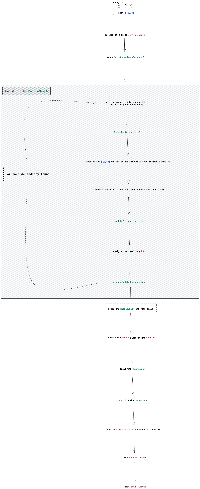

Webppack là một công cụ hấp dẫn và mạnh mẽ, nó được xem như một thành phần hữu ích cho xây dựng web hiện đại được các lập trình viên thường xuyên sử dụng. Tuy nhiên, để làm việc với nó vẫn là một thử thách không dễ, nếu không muốn nói là rất phức tạp.

Trong bài viết này ta sẽ nói về các chi tiết hoạt động bên trong của Webpack, hy vọng rằng nó sẽ giúp webpack trông dễ tiếp cận hơn. Bài viết này sẽ cung cấp các kiến thức cơ bản về tính năng của webpack, bạn sẽ học được cách hoạt động của lazy loading, tree shaking, hay cách hoạt động của loader. Mục tiêu là bạn sẽ cảm thấy dễ dàng hơn khi giải quyết các vấn đề liên quan đến webpack. 

## Sơ đồ quá trình hoạt động của Webpack



Bạn nên mở linh [sau](), nó sẽ giải thích chi tiết hơn về cấu trúc các phần, mô tả từng bước của mô hình.

### Đối tượng `Entry`

Đây là phần rất quan trọng, bởi vì tất cả mọi thứ đều bắt đầu từ đối tượng `entry`. Nó hỗ trợ nhiều cấu hình, ta sẽ lấy một ví dụ đơn giản ở đây một đối tượng `entry` như một tập hợp các cặp key-value.

```js
entry: {
	a: './a.js',
	b: './b.js',
	/* ... */
}
```

Dễ thấy, một **module** trong webpack được liên kết với một file. Thế nên trong sơ đồ, `a.js` sẽ trả về một module mới và tương tự với `b.js`. Bây giờ, 